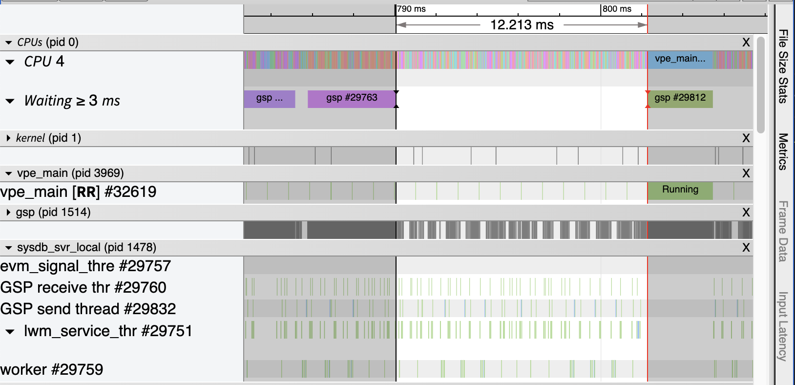

# Visualize thread scheduling data as Trace Events

This tool lets you visualize how a Linux system is scheduling threads over time:



It uses one collection script (wrapping `perf sched record`) on the target
system, to record the data (eg for 10 seconds), and then a second script to
convert this into Trace Event format. This can be visualized in eg Chrome's
Trace Viewer.

The collection script is a portable shell script, that should be compatible with
any Linux system supporting `perf`. The conversion script requires Python 3.10
or later.

## Usage

The tool has a three step workflow:


 - On the [most recent
   release](https://github.com/cisco-open/perf-trace-viewer/releases), download
   the two files `collect` and `perf_trace_viewer`,  and make both files
   executable (`chmod +x`).

 - On the target linux system, run the `collect` script. eg for 5 seconds of
   data, run `sudo ./collect 5`.

 - This produces a `perf-data-<datestamp>-<timestamp>.tar.xz` file or similar
   (depending on which compression options are available on the target system),
   that should be copied off, and processed using the `perf_trace_viewer`
   script. This requires Python 3.10 or later. For example, `./perf_trace_viewer
   <input file> <output file>`.

 - Visualize the data. eg in Chrome, open `chrome://tracing` and load the output
   file you just converted.

The `perf_trace_viewer` script is just a
[zipapp](https://docs.python.org/3/library/zipapp.html) (zipped set of `.py`
files that is executable on Linux, macOS and WSL) of the [perf_trace_viewer
source directory](perf_trace_viewer).

## FAQs

### Why does this tool exist?

There are [many existing
tools](https://profilerpedia.markhansen.co.nz/formats/linux-perf-sched/) that
transform the output of `perf sched record` into another format, but none that
let you visualize the output like this.

### What's so great about this sort of visualization?

If your performance bottleneck is just within a single process (eg a CPU-bound
computational task) then conventional profiling tools will help you. But when
the problem is system-wide (eg lots of small inefficient IPCs, or a particular
thread being starved due to some other high priority task) then there is no
substitute to being able to clearly see that.

### Can I customize what data is recorded?

The `collect` script can pass any arguments to `perf sched record` via `-o`. For
example, to record 10 seconds of data only on CPU cores 0, 2 and 3, you can run:

    ./collect -o "-C 0,2-3" 10

### How do I resolve errors from the `collect` script?

If you get an error from `collect` like this:
```
ERROR: 'perf sched record --mmap-pages 8M  -- sleep 5' failed with exit code 129
```
then just try running the quoted command (`perf sched record --mmap-pages 8M
-- sleep 5` in this case) independently, and resolve any issues. For example:

 - Is the target system running Linux?
 - Is the `perf` command correctly installed?
 - Are you running with root privileges?

Once you can run the quoted command correctly, just run the `collect` script in
the same way.

### How do I navigate the Chrome Trace viewer?

A few tips to get started:

 - `?` shows all keyboard shortcuts.
 - `W`, `A`, `S`, `D` are invaluable for navigation.
 - Mouse/trackpad scrolling, with or without the alt/option key, is also useful.
 - `0` resets the timeline.
 - `4` lets you measure time easily. `1` restores the default selection
   behavior.

Processes are ordered with the most active at the top. You can expand/shrink the
view for every thread within a process using the triangle to the left of the
process name. There are also two pseudo-processes at the top:
 - The CPU process summarizes the scheduled work for each CPU core, and also has
   a special track showing any threads blocked for more than 3ms. (You can
   change this threshold via command-line options to `perf_trace_viewer`.)
- The kernel process summarizes kernel thread activity, including idle time.

### Why do some threads spill out across two rows?

Chrome Trace Viewer uses µs resolution, and the scheduling data uses ns
resolution (when supported by the version of perf). This disparity can mean
events that are close in time get spilled out into two rows by the Trace Viewer.
Ignore it.

### Why aren't you using Perfetto?

Perfetto is the replacement to Chrome Trace Viewer, and is where development
activity is. It also offers some useful capabilities, such as native support for
scheduling events, and a more performant binary data format.

Perfetto works fine with this tool, and you're welcome to use it if you prefer.
However, when this tool was started, Perfetto was less useful than classic Trace
Viewer for quickly analyzing the sort of big system for which this tool was
created, and we tend to find insights quicker using the classic tool. YMMV.

### Why do you need a big conversion script, when `perf script` exists?

[perf script](https://man7.org/linux/man-pages/man1/perf-script.1.html) makes it
easy to run a small Python script over a `perf.data` file. However, it is
inadquate for the task here. For example:

- The `perf script` does not provide access to the `PERF_RECORD_COMM` records
   providing the process/thread hierarchy at the start of a recording session,
   so we need to parse the more raw ascii output instead.

- If `perf sched record` is run in a pid namespace (as is typical for my use
  case), then the `PERF_RECORD_COMM` data is from outside the namespace, but
  the pids from the actual events are from within the namespace, so they don't
  match up. So the script here goes to some efforts to make sense of everything.

- `perf script` does not make it easy to do things like add the CPU/kernel
  pseudo-processes noted above.

### Can I augment the visuation with extra data, such as arrows for IPC calls?

This is not supported yet, but is a possible future enhancement (using [perf's
support](https://lwn.net/Articles/570818/) for [SDT
points](https://sourceware.org/systemtap/wiki/AddingUserSpaceProbingToApps) for
instrumenting the IPC calls).

### How do I make a new release?

 - Make any commits that are needed.
 - Tag the release commit (eg `git tag v1.0`)
 - Push it to GitHub (eg `git push origin main v1.0`)
 - If CI passes, then a release will be created with downloadable scripts

